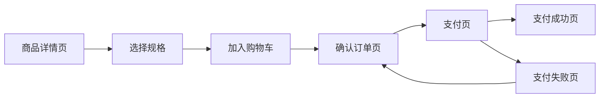
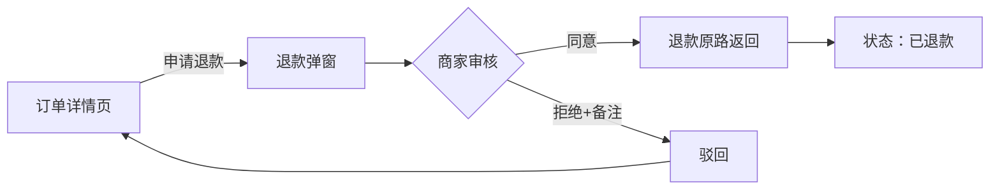
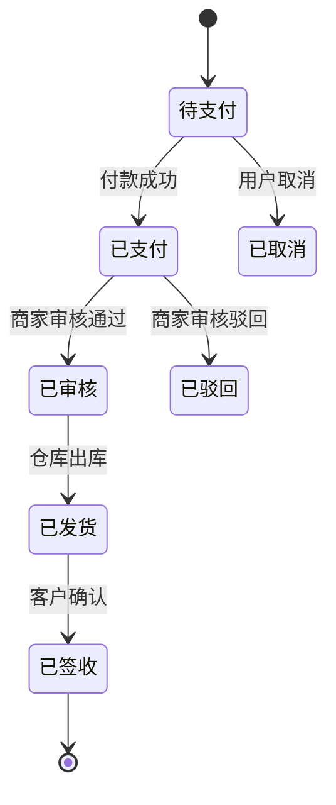

# Product Requirements Document (PRD) — Prototype-Oriented

## Core Philosophy

**PRD不是文档，是原型生成指令。** 每一条需求必须能直接翻译成DOM元素+交互逻辑+Mock数据。抽象描述和模糊需求会被跳过或脑补。

**原型不是「照着PRD画页面」，而是「把PRD每条需求翻译成可视化的、可交互的、可评审的产品实物」。**

> 🌐 本技能已开源至 GitHub：https://github.com/kangedy/prd-king
> 包含：SKILL.md（Hermes技能）、templates/（商用版+AI原型版双模板）、references/（设计体系参考）
> 
> 🔧 配套原型工作流（独立仓库）：https://github.com/kangedy/prototype-king
> **使用链路：prd-king 写PRD → prototype-king 转原型 → verify-prototype.py 验收**

## Default Design Specification: Ant Design

PRD默认采用 **Ant Design 5.x** 作为设计规范。Token体系直接映射CSS变量，组件直接对应HTML结构，是唯一能当代码规范用的设计体系。

### Why Ant Design

| 原因 | 说明 |
|------|------|
| **原生Web组件体系** | 72个组件覆盖原型90%场景，PRD写组件名即生成 |
| **Token→CSS直接映射** | `@primary-color` → `--brand-primary`，零转换成本 |
| **中国企业级事实标准** | 甲方/开发团队全部熟悉，评审零学习成本 |
| **8px网格+24列栅格** | 纯CSS可实现，不依赖框架 |
| **开源免费MIT协议** | 原型直接用，无版权问题 |

### 国产专业设计体系可选方案（6+2）

### 国产专业设计体系可选方案（6+2）

当甲方有指定设计体系或项目类型不同时，从以下6大国产体系 + 2外部体系中选择。详细Token/组件数/优缺点见 `references/design-system-options.md`。
| ② | **Element Plus** | 饿了么 | #409EFF | Vue 3 | Vue3 B端后台 |
| ③ | **TDesign** | 腾讯 | #0052D9 | 全端覆盖 | Web+小程序全端统一 |
| ④ | **Arco Design** | 字节 | #165DFF | React/Vue3 | 现代年轻化B端 |
| ⑤ | **Semi Design** | 抖音 | #0077FA | React | 数据密集型后台 |
| ⑥ | **NutUI** | 京东 | #FA2C19 | Vue 3 | 移动端电商H5 |
| ⑦ | 微信WeUI | 微信 | #07C160 | 原生 | 小程序 |
| ⑧ | Apple HIG | Apple | #0066CC | iOS | iOS原生App |

**决策树：**
```
PRD是否有甲方指定设计体系？→ 是: 按甲方 / 否: 技术栈?
  React B端 → Ant Design 5.x(默认)  |  Vue3 B端 → Element Plus
  全端统一 → TDesign  |  现代B端 → Arco  |  数据密集 → Semi
  移动电商 → NutUI  |  小程序 → WeUI  |  iOS → Apple HIG
  不确定 → Ant Design(最安全)
```

**Token快速套用：** 选好体系后，从 `references/design-system-options.md` 复制对应CSS变量块到PRD Ch1即可。

## When to Use

Use this skill when:

- Starting a new product or feature development cycle
- Translating a vague idea into a concrete technical specification
- Defining requirements for AI-powered features
- Stakeholders need a unified "source of truth" for project scope
- User asks to "write a PRD", "document requirements", or "plan a feature"
- User points at a deployed frontend app (URL/IP) and says "根据这个导出PRD" or "看下这个网站写个PRD":
  - If the app is a React/Vite/Next.js SPA → use SPA reverse-engineering workflow (Phase 0a, references/spa-reverse-engineering-prd.md)
  - If the app is a RuoYi/若依 traditional SSR system (Thymeleaf/Bootstrap, server-rendered HTML, NOT an SPA) → use RuoYi SSR reverse-engineering workflow (references/ruoyi-ssr-reverse-engineering.md for full post-login workflow, references/ruoyi-reverse-engineering-prd.md for pre-login probing)

---

## Operational Workflow

### Phase 0: Context Research (Before Asking Questions)

When the user references previous work ("根据之前的资料", "按之前的需求", past project files), do NOT jump to asking questions. First gather context:

1. **session_search()** — Search past sessions for the project name, keywords, and related terms. The user may have discussed this extensively in previous conversations.
2. **Read project files** — Check the user's home directory (`~`), project directories, `/mnt/` paths for .md, .docx, .pdf, .xlsx files related to the project.
3. **Check memory** — See if memory has relevant notes about the project.
4. **Search for existing PRDs/plans** — Look for prior deliverables (PRDs, specs, requirement lists, confirmation docs).

Only ask questions AFTER exhausting available context. The user's expectation is that you remember what they've already done.

### Phase 0c: Pre-PRD Structured Interview (高效产出关键)

完成Context Research后，**不要直接开始写PRD**。先用结构化问题补齐关键信息缺口。规则：

1. **只问Context Research没找到的信息** — 如果session_search/memory/files已经回答了某条，跳过
2. **一次问完，不分多次** — 所有问题打包到一个消息里，让用户一次性回答
3. **标记已知/待问** — 每个问题标注状态，已知的自动填入

#### 快速问答表（3组11问）

执行流程：从A组到C组，Context Research已回答的自动标✅跳过，未知的集中提问。

**组A · 必答（影响所有章节）— 4问**
```
[ ] ① 项目名称/定位：一句话说清做什么？
[ ] ② 核心业务流程：用箭头描述主线（如：下单→审核→发货→确认）
[ ] ③ 技术栈：React / Vue3 / 小程序 / 不确定？
[ ] ④ 用户角色：有哪些角色？权限分层？
```

**组B · 设计（影响Ch1-2）— 3问**
```
[ ] ⑤ 品牌VI/设计规范：甲方有指定设计系统或品牌色板吗？
        → 有：发我参考文件  /  无：默认Ant Design 5.x
[ ] ⑥ 一级模块清单：系统有哪些主菜单？（3-7个）
[ ] ⑦ 输出用途：这次PRD的用途是？
        → A.甲方交付/合同附件  → 用VERSION A商用版
        → B.AI直接生成原型    → 用VERSION B原型版
        → C.内部开发排期      → 用VERSION A精简版
```

**组C · 范围（影响Ch3-7）— 5问**
```
[ ] ⑧ 关键异常场景：审核驳回/支付失败/退款等需处理的？
[ ] ⑨ 核心操作：每页最重要的3-5个操作（如订单列表：搜索/审核/导出）
[ ] ⑩ 时间线：首期截止日期？分几期交付？
[ ] ⑪ 竞品参考：是否有竞品可以发链接？
[ ] ⑫ 运营指标需求（可运营性，影响Ch11）：上线后运营要看哪些数据？
        看板/报表/统计口径——如订单量趋势/转化漏斗/区域分布/客服工单量。
        无明确需求时默认：按核心业务流程每个环节配1-2个核心指标 + 总览看板页。
        背景：需求开发流程v1.3铁律——设计阶段必须考虑"可统计/可跟踪/可分析"，无运营看板方案不通过。
```

#### 问卷执行示例

当Context Research已经找到了部分信息时，只问缺失的：

```
🤖 以下信息我已知，不再问：
  ✅ 项目名称：鑫广汽拆管理系统
  ✅ 技术栈：Vue 3 — 已在PRD中指定
  ✅ 用户角色：管理员/拆解员/质检员/财务 — 上轮已确认
  ✅ 核心流程：收车→验车→拆解→质检→入库→销售

还需要你确认：
  ① 设计体系：甲方指定了还是自选？无指定我默认 Element Plus（Vue3对应）
  ② 一级模块：交易/仓储/车辆/系统 — 还有遗漏吗？
  ③ 输出用途：这次PRD是给甲方交付(A)还是直接出原型(B)？
```

#### 禁忌

- ❌ 问「你希望PRD什么格式」→ 默认按10章标准输出
- ❌ 问「你希望用什么工具写」→ 默认MD+可选DOCX
- ❌ 问「你还有什么要补充的吗」→ 一次性问完，不问开放式结尾
- ❌ 在用户回答后追烦「那X模块有什么功能」→ 已有的信息足够开始写了，功能点不够在Ch6补

### Phase 0b: Updating Existing PRDs (Policy/Doc Alignment) — CRITICAL

When the user says "基于最新的XX文档完善/更新PRD" or "对齐新政策输出一版"，you are doing an **incremental revision**, NOT a recreation. This is the single most common pitfall — recreating from scratch loses 50%+ of original content (detailed function point tables, acceptance criteria, flowcharts) and the user will immediately notice.

**Golden rule**: Open the original .docx with python-docx, make TARGETED edits, save as new version. Never read-then-recreate.

**Workflow**:

1. **Read both documents** — Extract text from the new policy/source document AND the existing PRD. Compare and identify EXACTLY what changed (specific paragraphs, tables, values).
2. **Index the original** — Use python-docx to print every paragraph with its index and style. Identify exact paragraph indices and table indices that need changing.
3. **Make targeted edits** — Use `para.clear()` + `para.add_run()` for paragraph text replacements. Use cell-level table edits. Use `docx.oxml.OxmlElement` for inserting new paragraphs/tables at specific positions.
4. **Insert new sections** — For structural additions (new modules, new chapters), use lxml `addprevious()` on a target element's underlying XML. Process insertions in REVERSE order to avoid index shifting.
5. **Verify** — The final document must contain ALL original content + only the targeted changes. Check file size (should be LARGER, never smaller).

**Common mistakes that KILL this workflow**:
- Reading the original then writing a new docx — loses ALL original formatting, tables, images, detail
- Using `doc.add_paragraph()` on a fresh Document() — this is recreation, not revision
- Summarizing unchanged modules to one sentence — the user said "更新PRD" not "summarize PRD"

See `references/prd-incremental-revision.md` for the full technical walkthrough with python-docx + lxml patterns.

### Phase 0a: SPA Reverse-Engineering (No docs, only a deployed app)

When the user points at a deployed frontend URL and wants a PRD, use the SPA reverse-engineering workflow. See `references/spa-reverse-engineering-prd.md` for the full 5-step process:

1. **HTML Entry** — Identify SPA type, bundle filenames, product title
2. **Main JS Bundle** — Extract routes, components, auth, roles, data constants, Lucide icons
3. **CSS Bundle** — Extract design system tokens (colors, radius, fonts, framework)
4. **Individual Chunks** — Extract mock data models, status enums, UI labels, form fields
5. **Compile** — Map all findings to standard PRD schema

This workflow avoids browser navigation entirely — all information is recoverable from static assets via curl. Produces development-ready PRDs with field-level data models and complete state machines.

### Phase 0a-2: RuoYi Server-Rendered Reverse-Engineering (No docs, only a deployed RuoYi app)

When the target is a RuoYi/若依 traditional server-rendered system (SpringBoot + Thymeleaf + Bootstrap, NOT an SPA), use the RuoYi reverse-engineering workflow. This has TWO stages:

**Stage A — Pre-login probing** (see `references/ruoyi-reverse-engineering-prd.md`):
1. Confirm system identity from login page HTML (system name, copyright, tech fingerprint `/ruoyi/js/ry-ui.js`)
2. Mine `ry-ui.js` for `ctx + "path"` patterns and custom jQuery selectors (`#hphm`, `#carNos`, `#supervisedCar`)
3. 302 route probing — batch-probe potential paths; 302→login = valid route, 404 = doesn't exist
4. Infer data model from custom selectors found in JS
5. Confirm RuoYi standard `{code, msg, data}` JSON response shape via AJAX
6. Request credentials from user when probe reveals enough modules to justify full exploration

**Stage B — Full post-login extraction** (see `references/ruoyi-ssr-reverse-engineering.md`):
1. Login via curl with session cookies (POST `/login`, watch for account lockout after 5 failures)
2. Extract full sidebar menu tree from `/index` HTML (`<ul class="nav" id="side-menu">`)
3. Map all module paths and sub-pages from menu HTML
4. Batch-scrape table columns from JS using execute_code — RuoYi defines columns as `{field:'x', title:'y'}` in page-level `<script>`, NOT in HTML `<th>` elements
5. Extract search form fields (inputs with name/placeholder attributes)
6. Compile complete PRD with field-level data models

Key difference from SPA workflow: RuoYi apps have NO JS bundles to mine for routes — all server-side rendering. Routes live in the database (sys_menu table), inaccessible without auth. Table columns are in page-level JS, not visible in raw HTML templates.

### Phase 1: Discovery & Scoping

> ⚠️ **不要跳过Phase 0c直接到这里。** 先执行完Pre-PRD结构访谈再进入分析阶段。

Based on the Phase 0c interview results, synthesize and confirm:

- **Confirmed scope**: Verify the user's answers against PRD chapters 1-10
- **Priority alignment**: Map modules to P0/P1/P2 and MoSCoW
- **Risk identification**: Spot any scope creep or ambiguity in the interview answers
- **Confirm output format**: Default = Markdown (可选 DOCX/PDF)

**如果用户之前没有经过Phase 0c就要求写PRD，主动触发一次结构化访谈再继续。**

### Phase 2: Analysis & Structuring

Synthesize all available context + user input. For multi-subsystem PRDs, map out the architecture first:

- **Subsystem boundaries**: What does each subsystem own? What are the data flows between them?
- **Module inventory**: List all modules per subsystem, assign IDs, priorities, and dependencies.
- **Dependency chain**: Determine which subsystems/modules must ship first. Core infrastructure → business logic → surface features.
- **Phased delivery**: Group modules into delivery phases based on dependency chains and timeline constraints.

### Phase 3: Technical Drafting

Generate the document using the **Strict PRD Schema** below.

---

## PRD Quality Standards

### Requirements Quality — Concrete & Measurable

Use concrete, measurable criteria. Avoid "fast", "easy", or "intuitive".

```diff
# Vague (BAD)
- The search should be fast and return relevant results.
- The UI must look modern and be easy to use.

# Concrete (GOOD)
+ The search must return results within 200ms for a 10k record dataset.
+ The search algorithm must achieve >= 85% Precision@10 in benchmark evals.
+ The UI must follow Ant Design 5.x token spec with --brand-primary: #1677FF.
```

### Prototype-Readiness Quality Gates

Every PRD section has a **priority level** that determines what the prototype generator does:

| Priority | Label | If present | If missing |
|----------|-------|-----------|------------|
| **P0 · Must** | 🔴 原型硬依赖 | 直接生成对应DOM/交互/数据 | 原型缺页/缺字段/缺交互，不可交付 |
| **P1 · Should** | 🟡 强烈建议 | 原型更完整，评审通过率↑50% | 原型可生成但评审时会返工补 |
| **P2 · Nice** | 🟢 锦上添花 | 原型边界覆盖全，接近生产级 | 评审时标注「待补」，不影响首版 |

### 5 Bad Patterns to Catch (and Reject)

| # | 坏写法 | 问题 | 替换方案 |
|---|--------|------|---------|
| 1 | 「支持多种查询方式」 | 枚举不完整，靠猜 | 「查询条件：订单号/手机号/车牌号/日期范围」 |
| 2 | 「入库分为整车和零散等多种方式」 | 「多种」到底几种？ | 列全7种：按车/OE/VIN/品类/批量/退货/调拨 |
| 3 | 「仓储管理 - 完成」 | 页面级粒度，按钮无交互 | 按钮级：新增/编辑/删除/导入/导出/审核/打印 |
| 4 | 「订单列表展示订单信息」 | 只有理想态 | +空态/加载态/搜索无结果/网络错误 |
| 5 | 「系统管理模块」 | 不提导航/角色/TAB | 侧栏两级+角色菜单映射+页面内Tab结构 |

---

## Prototype-Oriented PRD Schema (10 Chapters)

你 **MUST** 按照这个10章结构输出PRD。每章标注 P0/P1/P2 优先级，缺失P0内容直接导致原型生成质量不合格。

---

### Chapter 1 · Design Specification — Ant Design (P0 · 原型硬依赖)

**作用：** 设计系统决定了原型所有样式变量。没有它，我的生成器只能盲猜设计。

```css
/* Ant Design 5.x 默认Token — 直接嵌入PRD，按项目修改色值 */
--brand-primary: #1677FF;
--brand-bg: #F5F7FA;
--sidebar-bg: #001529;
--radius-card: 6px;
--font-size-body: 14px;
```

**验收标准（PRD是否已写好设计规范）：**
- [ ] 品牌色已定义（至少主色+背景色）
- [ ] UI框架已选定（Ant Design / Element Plus / 自研）
- [ ] Token变量覆盖：颜色 / 字号 / 圆角 / 间距 / 触摸目标
- [ ] 组件风格已注明（Ant Design组件参考）

---

### Chapter 2 · Information Architecture — 信息架构 (P0 · 原型硬依赖)

**作用：** 决定页面导航骨架。没有它，原型有页面但用户找不到。

必须用树形层级写清所有页面和菜单关系：

```
├── 首页 (/dashboard)
├── 交易管理 (/trade)
│   ├── 订单列表 (/trade/order)
│   │   ├── 全部订单
│   │   ├── 待审核
│   │   └── 已完成
│   └── 退款管理 (/trade/refund)
├── 商品管理 (/product)
│   ├── 商品列表 (/product/list)
│   ├── 分类管理 (/product/category)
│   └── 品牌管理 (/product/brand)
└── 系统设置 (/system)
    ├── 用户管理 (/system/user)
    ├── 角色管理 (/system/role)
    └── 日志管理 (/system/log)

角色-菜单映射：
- 超级管理员：全部菜单
- 运营：交易管理 + 报表中心
- 商家：商品管理 + 订单管理
```

**验收标准：**
- [ ] 所有页面有唯一 data-page / URL 标识
- [ ] 导航层级明确（一级/二级/三级）
- [ ] 角色-菜单映射已定义
- [ ] 默认落地页已指定

---

### Chapter 3 · Business Process — 业务流程 (P1 · 强烈建议)

**作用：** 决定页面之间的跳转关系。没有它，单页正确但流程走不通。

每个流程使用 Mermaid 流程图标注页面跳转、分支条件、异常路径：






**状态变更使用状态机图表达：**



**验收标准：**
- [ ] P0核心流程已定义（影响主业务的功能路径）
- [ ] 每个流转步骤标注对应页面/弹窗
- [ ] 异常流程同样记录（支付失败/审核驳回）
- [ ] 状态变更明确（从什么状态变成什么状态）

---

### Chapter 4 · System Architecture Context — 系统架构上下文 (P2 · 按需)

**作用：** 仅影响原型设计的架构信息。微服务/数据库/消息队列等对原型生成零影响，不写。

**需要写的内容（只限影响原型设计）：**

```markdown
角色权限体系（影响按钮显示/隐藏）：
- 超级管理员：全部按钮可见
- 运营：只有「审核」「导出」「查看」，无「删除」「编辑」
- 商家：只有「商品管理」「订单管理」，无「系统设置」

数据流向（影响Mock数据结构）：
- 订单数据来源：外部ERP同步 → 本地缓存 → 展示
- 商品图片：OSS/CDN地址，格式 https://img.{domain}/{key}
- 缓存策略：订单列表本地缓存5分钟

接口设计规范（影响Mock数据格式）：
- 统一返回格式：{code: 0, msg: "success", data: {}}
- 翻页参数：page/pageSize
- 状态值格式：枚举字符串，非数字编码
```

**不需要写的架构细节：**
- ❌ 微服务拆分 / 注册中心 / API网关
- ❌ 数据库分库分表策略 / 读写分离
- ❌ 消息队列 / 分布式事务 / 缓存中间件
- ❌ 部署方式 / Docker / K8s / CI/CD流水线

---

### Chapter 5 · Page Inventory — 页面清单 (P0 · 原型硬依赖)

**作用：** 每个页面条目 = 原型生成的一个HTML文件/模块。遗漏 = 原型缺页。

**每页必须回答：** 用户在这个页面能做什么操作？每个操作对应什么弹窗/表单？
**弹窗命名规则：** `{page}-add` / `{page}-edit` / `{page}-detail` / `{page}-{action}`

```
页面清单：
| data-page | 页面标题 | 所属模块 | 布局类型 | 依赖数据对象 | 弹窗清单 |
|-----------|---------|---------|---------|-------------|---------|
| dashboad | 数据概览 | 首页 | 看板 | 订单统计/销售排行 | — |
| order-list | 订单列表 | 交易管理 | 表格+筛选 | Order | add(含8字段:订单号/客户/手机号/金额/支付方式/状态/备注/创建时间)+edit(同add预填)+detail(只读) |
| order-detail | 订单详情 | 交易管理 | 详情展示 | Order/OrderItem | review(审核弹窗:审核结果radio+驳回原因textarea) |
| order-review | 审核弹窗 | 交易管理 | Modal表单 | Review | — |
```

**弹窗字段定义规范：**
```
add(含6字段:任务名称/执行策略cron/优先级/状态/通知方式/备注)
edit(同add预填)  
detail(只读展示+操作日志)
```

**约束：**
- 每个页面必须有唯一 data-page 标识
- 布局类型标注（表格/详情/看板/表单/Modal等）
- 依赖数据对象标注（对应Chapter 7的实体名称）
- 有add/edit操作的页面必须在「弹窗清单」列标注字段数和来源实体

---

### Chapter 6 · Feature Inventory — 功能点清单 (P0 · 原型硬依赖)

**作用：** 交互地图。**每个按钮、每个弹窗、每个操作都必须在此列出。** 抽象描述「具备增删改查」→ 不合格。

```
订单列表页 (order-list) 功能点：
| # | 操作类型 | 动作名称 | 触发方式 | 结果 | 数据来源 |
|---|---------|---------|---------|------|---------|
| 1 | Search | 查询订单 | 点击搜索按钮 | 表格刷新 | API: /order/list |
| 2 | Navigation | 查看详情 | 点击表格行 | 跳转 order-detail | URL参数: id |
| 3 | Modal | 审核订单 | 点击审核按钮 | 弹出审核弹窗 | mockReviewData |
| 4 | Download | 导出Excel | 点击导出按钮 | 文件触发下载 | API: /order/export |
| 5 | Modal+Batch | 批量审核 | 勾选+点击批量审核 | 弹出审核弹窗 | selectedIds |

操作类型枚举（选一个）：
- Search — 搜索/筛选，结果回填表格
- Navigation — 跳转页面
- Modal — 弹出弹窗（标注弹窗名）
- Submit — 表单提交
- Download — 文件下载
- Delete — 删除（标注是否二次确认）
- Batch — 批量操作（标注勾选条件）
- Switch — Tab/状态切换
- Refresh — 数据刷新
```

**验收标准（逐按钮检查）：**
- [ ] 每个按钮/操作有唯一条目
- [ ] 操作类型明确
- [ ] 触发方式明确（点击/双击/勾选后触发）
- [ ] 结果明确（跳转/弹窗/刷新/下载）
- [ ] 枚举值全部列全（「多种入库方式」≈7种，必须展开）

---

### Chapter 7 · Data Model — 数据模型 (P0 · 原型硬分配)

**作用：** 字段 = 原型所有输入输出控件的完整清单。**表头字段 = 字段定义子集，不是反过来。**

```
订单实体 (Order)：
| 字段名 | 类型 | 必填 | 选项值/范围 | 展示控件 | 备注 |
|--------|------|------|------------|---------|------|
| order_id | string | 是 | — | 文本 | 系统自动生成 |
| status | enum | 是 | pending/approved/rejected/cancelled | 标签+颜色 | 各状态颜色见状态机 |
| customer_name | string | 是 | — | 输入框 | 最长32字 |
| amount | number | 是 | ≥0.01 | 金额¥格式化 | 保留两位小数 |
| phone | string | 是 | 11位数字 | 输入框+格式校验 | 正则：1[3-9]\d{9} |
| payment_method | enum | 是 | wechat/alipay/transfer | 单选按钮组 | — |
| created_at | datetime | 是 | — | 日期时间选择器 | YYYY-MM-DD HH:mm |
| remark | string | 否 | — | 文本域 | 最长200字 |
```

**注意事项：**
- 每个实体独立表格，一个实体一个表
- **枚举字段的选项值必须用中文（用户可见），且直接映射到原型的下拉菜单选项**。示例：
  ```
  | status | enum | 是 | 启用/停用 | Select | 状态颜色见状态机 |
  | level | enum | 是 | 普通/银卡/金卡/钻石 | Select | — |
  | type | enum | 是 | 满减/折扣/现金 | Select | — |
  ```
  注意：Mock数据和ENTITY_COLUMNS都使用中文值，所以选项值必须用中文，不用英文代码。
  ⚠️ **不同实体的同名字段（如status）选项值不同，必须按业务场景分别定义。禁止用replace_all统一替换所有status的选项值。** 例如：客户状态是"准客户/正式客户/活跃/休眠/注销"，会员状态是"正常/冻结/注销"，商品状态是"草稿/已上架/已下架"。
- 选项值枚举必须**列全部选项**，不可写「见上文」
- 控件类型标准化（Ant Design：Input/Select/DatePicker/InputNumber等）
- 格式校验规则必须写明（正则/长度/范围/进制）

---

### Chapter 8 · Mock Data — 模拟数据 (P0 · 原型硬依赖)

**作用：** 决定原型真实感。填「测试数据」和填真实业务数据的原型，评审通过率差5倍。

**要求：**
```
1. 正常数据（5~10条有意义的业务数据）
   - 示例：订单号"A202601010001"，金额"¥3,842.50"，状态"待审核"
   - 关联实体跨页面一致（订单ID=车辆档案ID=质检记录ID）
   - 金额计算可验证（公式写在注释中）

2. 空数据
   - 无搜索结果时的展示文案
   - 空列表引导文字+操作按钮

3. 极限数据
   - 超长文本（100字以上的备注/地址）
   - 超大金额（¥9,999,999.99）
   - 1000条分页数据（至少标注分页策略）
   - 日期范围极值（1970-01-01 / 2099-12-31）
```

---

### Chapter 9 · Boundary Conditions — 边界条件 (P1 · 强烈建议)

**作用：** 决定原型异常态的展示方式。

```
边界条件（必须覆盖）：
| 场景 | 原型处理方式 |
|------|------------|
| 无权限操作 | 按钮灰显 + tooltip「联系管理员开通权限」 |
| 表单必填项校验失败 | 红色边框 + 提示文字（字段下方原位提示） |
| 网络错误 | Toast「网络异常，请稍后重试」+ 重试按钮 |
| 并发操作（别人正在审核） | Toast「该订单正在被审核」+ 列表灰显 |
| 翻页后选中状态 | 跨页全选还是本页全选？（指定规则） |
| 金额精度 | 保留两位小数，¥0.00 显示为「¥0.00」 |
| 超长文本溢出 | 文本截断... + Tooltip显示全文 |
| 空数据引导 | 空态插画 + 「暂无数据，点击新增」 |
```

---

### Chapter 10 · Acceptance Criteria — 验收标准 (P0 · 原型硬依赖)

**作用：** 每个模块验收 = 保证原型可交互、可走查。

```
每个模块必答3问：
1. List — 数据在哪展示？用什么组件？
   → 订单列表用Ant Design Table + Pagination + 搜索筛选
2. Detail — 点击一行能看到什么？
   → 点击订单行跳转到 order-detail 页（路由：/order/{id}）
3. Action — 用户能做什么？
   → 搜索/查看/审核/导出/批量审核（共5个操作）

验收门禁：
- G1 功能完整性：每个功能点的操作按钮有handler
- G2 页面完整性：Chapter 5所有data-page存在且可渲染
- G3 字段完整性：Chapter 7所有字段在原型中出现
- G4 数据一致性：同一实体跨页面数据一致
- G5 状态覆盖：每个列表页有空态+加载态
- G6 字号合规：正文≥14px / 表格≥13px / 标签≥12px
- G7 JS语法正确：node --check 无语法错误
- G8 按钮无遗漏：每个<button>有 onclick/data-action/type=submit
```

---

### Chapter 11 · 运营指标与看板需求 (P1 · 强烈建议 · 可运营性铁律)

**作用：** 对应需求开发流程 v1.3 阶段0「运营指标需求清单」+ 阶段2「可运营性设计」——确保上线后运营可统计、可跟踪、可分析。功能上线但运营"两眼一抹黑"是设计缺陷。

```markdown
### 11.1 核心指标清单
| 指标 | 口径定义（勿模糊） | 数据来源 | 展示频率 |
|------|------------------|---------|---------|
| 订单量 | 当日成功支付订单数 | 订单表 | 日 |
| 转化率 | 咨询→成交 | 咨询+订单表 | 日 |
| ... | ... | ... | ... |

### 11.2 看板页面规划（Ch5 页面清单中补充）
| 看板页 | 指标卡片 | 图表（类型×维度） | 下钻 |
|-------|---------|------------------|------|
| 运营总览 | 订单量/GMV/用户数 | 折线图×时间趋势 | 点击进入明细 |

### 11.3 指标口径规则
- 每个指标必须定义：统计周期、统计对象（全部/去重）、时区、单位
- 金额类指标注明币种与精度
- 口径一旦定义不可随意变更（变更需版本记录）
```

**验收标准（Ch10 联动）：**
- [ ] 核心业务流程每个环节至少1个可统计指标
- [ ] 看板页已列入 Ch5 页面清单
- [ ] 指标口径已定义且无模糊表述（"多种"/"相关"不合格）
- [ ] 验收阶段：看板数据与业务数据库实际数据交叉核对一致

---

## 10章优先级总表

```
Chapter | 标题 | 优先级 | 原型生成行为
--------|------|--------|-------------
Ch1     | 设计规范 | 🔴 P0 | 生成design-tokens.css，搭建设计系统
Ch2     | 信息架构 | 🔴 P0 | 生成侧栏/导航菜单，路由表
Ch3     | 业务流程 | 🟡 P1 | 生成页面间跳转关系，指引交互流
Ch4     | 系统架构 | 🟢 P2 | 生成权限按钮显隐，数据流向Mock
Ch5     | 页面清单 | 🔴 P0 | 生成每个HTML页面入口
Ch6     | 功能点清单 | 🔴 P0 | 生成每个按钮/弹窗/操作的handler
Ch7     | 数据模型 | 🔴 P0 | 生成表单字段/表格列/详情展示
Ch8     | Mock数据 | 🔴 P0 | 生成Mock数据池，注入真实感
Ch9     | 边界条件 | 🟡 P1 | 生成空态/加载态/报错态页面变体
Ch10    | 验收标准 | 🔴 P0 | 生成自动化验收脚本checklist
```

---

## RuoYi/Thymeleaf SSR System Reverse-Engineering

When the target system is a RuoYi (若依) or similar Thymeleaf-based SSR system (NOT an SPA), the SPA reverse-engineering workflow does NOT apply. Instead use this workflow:

### Step 1: Login and capture session

```bash
curl -s -c /tmp/cookies.txt -b /tmp/cookies.txt "$BASE/login" -o /dev/null
curl -s -c /tmp/cookies.txt -b /tmp/cookies.txt -X POST "$BASE/login" \
  --data-urlencode "username=admin" --data-urlencode "password=xxx" \
  --data-urlencode "rememberMe=false"
```

### Step 2: Extract menu structure from index page

The sidebar menu is rendered server-side in the HTML. Extract all `<a class="menuItem">` links and parent `<span class="nav-label">` groups from `/index`.

### Step 3: Extract table columns from list pages

Table columns are defined in JavaScript `{field:'xxx', title:'xxx'}` objects, NOT in HTML `<th>` elements. Use regex: `\{[^}]*field\s*:\s*'([^']*)'[^}]*title\s*:\s*'([^']*)'[^}]*\}`

### Step 4: Extract COMPLETE form fields from /add and /edit endpoints (CRITICAL)

**This is the step that most PRDs miss.** List pages only show table columns (10-30 fields). The add/edit modal contains the FULL form (can be 80+ fields). Access directly:

```bash
curl -s -b /tmp/cookies.txt "$BASE/system/carinfo/shxg/add" > /tmp/form.html
```

Then extract ALL `name="..."` attributes and their corresponding `<label>` / `<th>` text. This reveals hidden fields, conditional fields, radio/checkbox options, and cascading selects that are invisible on the list page.

**Pitfall:** Do NOT rely on the list page's table columns alone to build the PRD. The table shows ~20% of the actual data model. Always pull the `/add` form to get 100% of fields.

### Step 5: Iterative deep-dive

First pass: table columns from list pages → baseline PRD.
Second pass: `/add` form fields from every module → complete PRD (often 3x more fields).
Third pass: cross-reference with `/edit/{id}` pages for edit-specific fields.

### Step 6: Check for hidden and conditional fields

RuoYi forms frequently use:
- `<input type="hidden">` for auto-computed values, sync fields, photo paths
- Conditional sections shown/hidden based on radio/select choices (e.g., battery fields only when EV selected)
- Checkbox groups that JS merges into comma-separated hidden inputs
- Select2/AJAX dynamic dropdowns whose options are loaded at runtime

All of these must be documented in the PRD.

### Step 7: Account locking pitfall

RuoYi's Shiro auth locks accounts after 5 failed attempts for 10 minutes. Each failed attempt resets the timer. Wait a full 10 minutes without any login attempts before retrying.

## Multi-Subsystem PRD Patterns

### Multi-Agent Parallel PRD Writing (large systems)

When the PRD covers 10+ modules / 1,500+ function points, delegate writing to 4 parallel product-specialist agents, each covering 2-4 scenario groups. The master agent writes Ch1-4 and Ch10, then merges all parts.

**Agent assignment template:**
```
Agent A: Scene group 1-2 (largest modules, ~600 points) → prd_part1.md
Agent B: Scene group 3-4 (~400 points) → prd_part2.md
Agent C: Scene group 5-6 (~460 points) → prd_part3.md
Agent D: Scene group 7 + system modules (~460 points) → prd_part4.md
```

**Each agent writes:** Ch5 页面清单 + Ch6 功能点清单 + Ch7 数据模型 + Ch8 Mock数据 + Ch9 边界条件

**Context must include:** Pre-extracted function point data (module→sub-module→count→type distribution), business rules (from source docx), scenario flow descriptions, output file path, exact PRD chapter format.

**Pitfall:** Do NOT ask agents to read the Excel/PRD files. Pre-extract data and embed in context to avoid timeout. Each agent's goal should be 150-200 lines of focused output per module.

**Merge:** Use `cat` to append parts to master, then append Ch10 acceptance criteria. Verify with `wc -l` and `grep -c '## Ch'`.

For the full prototype generation workflow that follows PRD completion (iframe SPA, 4-agent parallel, CSS pitfalls), see `references/prototype-from-prd.md` → section "并行委派生成 iframe SPA 原型".

For enterprise projects with multiple subsystems (e.g., 客户中心/会员中心/营销中心/数据中心), use these patterns.

### Organizational Context Mapping

For enterprise projects involving multiple business departments with independent authority, map the organizational structure early and embed it in the PRD:

1. **Identify all stakeholder departments** — List each business unit's name, core business scope, and decision-making authority.
2. **Map departments to subsystems** — Which department owns which functions? Which are data providers vs. consumers?
3. **Document autonomy boundaries** — If departments have independent operational authority (e.g., each sets their own pricing/marketing rules), the PRD must explicitly state where unification is mandatory (e.g.,积分价值折现率) vs. where autonomy is preserved (e.g.,积分发行规则).
4. **Capture existing systems per department** — Business units often have running legacy systems (小程序, 会员系统). The PRD must account for legacy system migration, not assume a greenfield build.

**Pattern from real project (某省级交通集团服务区七大事业部):**

```markdown
| 角色 | 描述 | 核心诉求 |
|:----|:-----|:---------|
| **U驿事业部** | 服务区商户全周期管理+自营品牌运营 | 商户招商、装修审核、合同管理、租金核算 |
| **油品事业部** | 服务区加油站运营与油品销售 | 油品采购/销售、油非互动配置 |
| **美美哒事业部** | 线上商业与会员体系运营 | 会员系统运营、积分兑换、合作品牌互通 |
```

### Legacy System Migration Module

When the client has existing systems with active users, include a dedicated migration module in the PRD body (mark P0 in Phase 1):

| Step | Component | Description |
|:-----|:----------|:------------|
| Audit | 存量数据摸底 | User count, level distribution,积分balance, coupons, transaction history |
| Identity mapping | 客户ID映射 | Legacy user ID → unified Customer ID (UCID), matched by phone+ID |
| Asset migration | 存量积分迁移 | 1:1 mapping, original issuer bears liability, 30-day user notification |
| Level mapping | 会员等级对接 | Map legacy N-level membership to unified tier system |
| Dual-run | 双轨运行期 | ~30 days parallel running with bidirectional sync |
| Verification | 数据一致性校验 | Full audit: user count,积分total, level distribution match |
| Rollback | 回滚预案 | Cut back to legacy system if error rate > 1%, fix and re-migrate |

### Module ID Convention

Assign each function module a unique ID for traceability:

```
{SubsystemCode}-M{NN}
{SubsystemCode}-M{NN}-{SS}  (sub-function points)
```

Examples: `CC-M01` (Customer Center, Module 01), `CC-M01-03` (sub-feature), `MC-M02` (Membership Center).

### Module Specification Table

Each module should have this structure:

```markdown
### {Module Name}

**功能ID：** {SubsystemCode}-M{NN}
**优先级：** P0/P1/P2 (P0=blocking, P1=required, P2=enhancement)
**依赖：** List of other modules this depends on

**需求描述：**
{1-3 sentence summary of what this module does}

**功能点：**

| 编号 | 功能点 | 详细说明 |
|:---|:------|:---------|
| {ID}-01 | {Feature name} | {Detailed description} |
| {ID}-02 | {Feature name} | {Detailed description} |

**验收标准：**
- Bullet list of measurable acceptance criteria
- Response time, accuracy, concurrency targets
```

### Dependency Chain

Document the dependency flow between subsystems:

```
{Base Subsystem} → {Business Subsystem} → {Interaction Subsystem}
     ↑                                            │
     └──── {Data/Analytics Subsystem} ────────────┘
```

Mark P0 modules in the dependency chain — those are the critical path for phased delivery.

### Batch Delivery Planning

For projects with tight deadlines, plan phased delivery:

| Phase | Scope | Timeline | Risk |
|:-----|:------|:--------:|:----:|
| **Phase 1 (Core)** | Base subsystem + critical business modules (P0 only) | By deadline | Low |
| **Phase 2 (Extension)** | P1 modules + secondary integrations | +1~2 months | Medium |
| **Phase 3 (Enhancement)** | P2 modules, advanced AI, analytics | +3~4 months | Low |

Apply compression logic: reuse existing systems where possible, accept MVP scope for first phase.

### External API Inventory

For multi-subsystem projects, maintain an API integration table:

| Interface | Partner | Purpose | Priority |
|:----------|:--------|:--------|:--------:|
| Data source | External system X | Data sync | P0 |
| Payment | Payment gateway | Transactions | P0 |

---

## Absorbed Skills

### prd-enhancement (archived → `references/prd-enhancement.md`)
Enhance Chinese PRD .docx files: add module-level interaction prototypes, editable business flowcharts (Pillow + draw.io), incremental revision aligning PRDs with policy documents via targeted table+text replacements.

## Reference Files

This skill ships with the following support files:

| File | Purpose |
|:-----|:--------|
| `templates/commercial-prd-template.md` | **VERSION A — 商用交付版PRD模板**（9章+附录，含项目概述/非功能需求/接口规范/风险路线图/竞品对标，适合甲方/老板/合同附件） |
| `templates/ai-prototype-prd-template.md` | **VERSION B — AI原型生成版PRD模板**（10章P0/P1/P2分级，含完整Mock数据/边界条件/验收门禁，直接翻译为HTML原型） |
| `references/design-system-options.md` | **6大国产+2外部设计体系Token完整参考** — Ant Design/Element Plus/TDesign/Arco Design/Semi Design/NutUI/WeUI/Apple HIG，选体系后复制CSS变量块即可 |
| — | **配套原型工作流**：`github.com/kangedy/prototype-king` — 8 Phase PRD→HTML原型流水线 + 自动化验收脚本（≥90%门禁）。先写PRD（本技能）→ 再转原型。 |
| `references/enterprise-prd-template.md` | Template for multi-subsystem enterprise PRDs — module ID conventions, dependency chains, batch delivery planning, acceptance criteria. Best paired with the Multi-Subsystem PRD Patterns section above. |
| `references/hunan-expressway-case.md` | 虚构案例（社区电商平台PRD）演示多子系统PRD拆解模式：模块编号规范、分批交付策略、组织上下文映射与遗留系统迁移。 |
| `references/checklist-to-prd-batch-generation.md` | **Checklist→PRD批量生成工作流** — 从甲方验收功能点清单(Excel)提取模块结构，批量生成一一映射的PRD补充章节。覆盖Excel偏移量导航、ILF/EI/EQ/EO→PRD内容映射、功能点分组→子模块详述的转换模式。Use when user says "输出第N批PRD补充" or "补全模块X的PRD" with a checklist Excel. |
| `references/spa-reverse-engineering-prd.md` | Reverse-engineer a complete PRD from a deployed React/Vite SPA with no documentation. Covers JS bundle mining, Chinese string extraction, feature synthesis, and data model inference from minified source code. |
| `references/ruoyi-reverse-engineering.md` | RuoYi(若依)框架系统的完整反向工程→PRD工作流：三Pass提取法（登录+菜单→表单字段→校验整合）、表单分步验证、账号锁定处理、子Agent外网限制解决 |
| `references/prd-incremental-revision.md` | Technical walkthrough: incremental .docx revision for PRD updates — indexing, paragraph/table replacement, lxml structural insertion, reverse-order processing, and the "never recreate" anti-pattern with real pitfall transcript. |
| `references/ruoyi-ssr-reverse-engineering.md` | **FULL post-login reverse-engineering** of a deployed RuoYi/若依 SSR admin system (Thymeleaf + Bootstrap + Shiro). Covers: Shiro login with session cookies + account lockout handling, HTML sidebar menu extraction, JS column definition scraping (`{field:'x', title:'y'}` in bootstrap-table), batch page analysis via execute_code (60+ pages in ~5s), and search form field extraction. Use when you HAVE login credentials and need complete field-level PRD. |
| `references/ruoyi-reverse-engineering-prd.md` | **Pre-login probing only** — mining JS files for module paths, 302 route probing, data model inference from custom selectors. Use when you DON'T have login access and need to estimate system scope before asking for credentials. |
| `references/ruoyi-extraction-patterns.md` | RuoYi SSR system field extraction patterns — menu, table columns, /add form fields, hidden fields, conditional display |
| `references/enterprise-to-ai-prototype-conversion.md` | Convert a subsystem-organized enterprise PRD to a 10-chapter AI prototype PRD. Covers dual-generation and conversion workflows, per-chapter extraction rules, multi-wave sub-agent dispatch, and mock data generation. Use when user says "这个PRD是AI开发版的吗？" or "生成AI开发版PRD". |
| `references/prd-incremental-revision.md` | Technical walkthrough: incremental .docx revision for PRD updates |
| `references/business-process-analysis.md` | Derive structured business process flows from a completed PRD or scraped system |
| `references/prototype-interactive-workflow.md` | **4波执行模型** — 从静态原型到全交互Demo：Mock数据550条→弹窗体系→CRUD逻辑(增删改查/分页/导出)→审批流转。含27项验证清单和"Toast模拟永不通过"陷阱。 |
| `references/prd-enum-options-mapping.md` | **枚举字段选项值→ENTITY_COLUMNS映射规范** — PRD Ch7 enum options提取标准、getEntityFields写法、openFormModal select渲染分支、30+常见枚举值表、验证清单。 |
| `references/prototype-from-prd.md` | Generate self-contained clickable HTML prototypes from PRD specs: design system setup, page structure patterns, modal/form conventions, factory functions for status pages, and common pitfalls. Use when user says "制作产品原型" or "出原型设计". |
| `references/iframe-spa-prototype-integration.md` | **Iframe SPA原型集成** — 将新页面集成到基于iframe+base64的现有原型中，4点Patch法（centerSections/items/embeddedSources/buildEmbeddedDocument），验证10项清单。适用于验收冲刺场景中增量扩展原型而非重写。 |
| `references/iframe-spa-multiagent-prototype.md` | **Iframe SPA多Agent并行原型生成** — 大规模原型（50+页）的标准工作流：母版壳+PAGE_MODULE映射+3+1Agent并行+hash路由+CSS pitfalls（overflow-x:auto裁切/currentPage跳过/映射hash缺失）。 |
| `references/gap-analysis.md` | Gap analysis between 甲方 requirements checklist and existing system: three-state tagging (🟢/🟡/🔴), HTML report design spec (靛紫渐变+毛玻璃+折叠卡片), three-phase delivery plan template. Use when user says "对标甲方要求交付功能清单" or "看看少哪些". |
| `references/prd-to-prototype-production.md` | **PRD→原型批量生产工作流** — PRD完成后从中生成完整测试原型的6阶段流程：提取页面清单→内容映射→初始SPA→并行填充→覆盖率验证→覆盖报告。50+页原型的标准生产流水线。 |
| `references/prd-consolidation.md` | Merge multiple PRD versions/partial documents into one final unified PRD: multi-file ingestion, deduplication, structure normalization, version archiving. Use when user says "整合成一版本完整PRD" or "全部合并成一份". |\n| **`scripts/validate-prd.py`** | 📌 **PRD结构校验脚本** — 交付前自动扫描PRD文件，检查全部P0章节完整性（Ch1/2/5/6/7/8/10），输出评分报告。`python3 scripts/validate-prd.py <prd-file.md>` |\n| **`references/open-source-publishing.md`

---

## Implementation Guidelines

### DO (Always)

- **Define Testing**: For AI systems, specify how to test and validate output quality.
- **Iterate**: Present a draft and ask for feedback on specific sections.
- **Default to Ant Design**: When no design spec is specified, use Ant Design 5.x tokens and components as default.
- **Use Checklist for Validation**: Track Chapter 1-10 with checkbox items for each substep, verify against the quality gates in Chapter 10.
- **Cross-reference data consistency**: Every field in data model appears in mock data and renders on at least one page.
- **Flag P0 gaps on draft**: When a PRD draft is missing a P0 chapter, call it out explicitly and require it before proceeding to prototype generation.
- **Choose the right version**: Use VERSION A (commercial-prd-template) for client-facing delivery, use VERSION B (ai-prototype-prd-template) for direct AI prototype generation. They share the same 10-chapter core but differ in depth and structure.
- **Point to prototype-king for implementation**: When the user needs an HTML prototype after the PRD is done, reference the companion repo: `github.com/kangedy/prototype-king` (8-Phase workflow + verify script).
- **Run self-check before delivery**: PRD写完交付前，先手动过自查清单，再跑自动校验：
```bash
python3 scripts/validate-prd.py output-prd.md
# 通过条件：≥80% P0门禁通过率
```
自查清单：

```
□ 所有P0章节完整（Ch1设计规范 / Ch2信息架构 / Ch5页面清单 / Ch6功能点清单 / Ch7数据模型 / Ch8 Mock数据 / Ch10验收标准）
□ 每个枚举值已列全（没有被「多种」「各类」模糊带过的）\n□ 每个功能点有明确操作类型+触发方式+结果（Ch6格式）\n□ 每个字段有类型+必填+选项值+校验规则（Ch7格式）\n□ 状态有对应的色值映射（Ch3状态机）\n□ 搜索条件已逐字段列出控件类型+options\n□ Mock数据有正常/空/极限三组\n□ 每个页面回答了List/Detail/Action三问（Ch10）\n□ 同一实体跨页面数据一致\n□ 原型生成后PAGE_ENTITY_MAP覆盖所有含CRUD操作的页面（grep验证）
□ 所有Button有handler（非死按钮）\n□ 每个有add/edit弹窗的页面在Ch5「弹窗清单」列标注了字段数和来源实体\n□ 每个弹窗字段在Ch7实体字段表中存在对应定义\n□ 如果从验收清单转换而来：已执行模块级覆盖验证（非关键词grep），在AI PRD中找到每个源三级模块的对应data-page
```

### DON'T (Avoid)

- **Skip Discovery**: Never write a PRD without asking at least 2 clarifying questions first.
- **Hallucinate Constraints**: If the user didn't specify a tech stack, ask or label it as TBD. Default to Ant Design.
- **Cut modules without asking**: When the client has an existing requirement list (e.g., 75 modules), do NOT propose removing modules or reducing scope. Users interpret this as de-scoping their project. Instead keep ALL modules and label each with Priority (P0-P3) and Complexity for phased delivery.
- **Recreate from scratch when updating**: When the user says to update an existing PRD, they mean INCREMENTAL REVISION on the original .docx. NEVER read the original then generate a fresh Document() — this loses all original formatting, tables, flowchart images, and detailed function point tables. Always use python-docx to open the original and make targeted edits.
- **Claim completeness after one pass**: When reverse-engineering a deployed system into a PRD, a single scraping pass ALWAYS misses 50-70% of fields. Table columns in list pages are only the tip of the iceberg. Use the Three-Pass Extraction Pattern: Pass 1 table columns, Pass 2 buttons/selects/labels, Pass 3 add/edit form endpoints.
- **Defend missing fields instead of fixing**: When the user says fields are missing, do NOT explain why. Immediately run a deeper extraction pass, specifically access add endpoints for every module. Proactively re-scan ALL remaining modules after any correction.
- **Separate project files**: Keep all related deliverables in one directory. Do not scatter project files across the home directory, project folders, and WPS cloud drives.
- **Trust sub-agent PRD merges**: When delegating PRD consolidation, sub-agents compress detailed field specs into summary sentences. Use terminal cat for mechanical file concatenation; reserve sub-agents for generating NEW integration material.
- **🔴 Agent timeout when reading large Excel in delegated context**: When delegating PRD-writing agents that need to read a large Excel (1,000+ rows), the agent may time out (>600s) because it spends too long reading/parsing the file. **Fix**: pre-extract the function point data on the main agent's side and embed it directly in the delegation context as structured text (module hierarchy with point counts and type ratios). Give agents the pre-digested data — they don't need to read Excel themselves. This cut agent time from timeout to ~8min. Applies to any delegation task where the sub-agent would read a large data file.
- **Large-scale parallel PRD pattern**: For 1,000+ function point PRDs: (1) Split by independent module groups, 3 agents parallel max (2) Provide pre-extracted function point data in context, not Excel paths; give type ratios per sub-module so agents can allocate properly (3) 2nd wave covers remaining modules (4) Merge all parts with `cat` — don't delegate merge (sub-agents compress detail) (5) Append common chapters (Ch1-4 design/IA/process/architecture, Ch10 acceptance) after merge. See `references/parallel-agent-prd-workflow.md`.
- **Use read_file on large files**: read_file defaults to limit=500 lines. For large PRD files, it SILENTLY returns only the first 500 lines. First call wc -l to get actual line count. Use terminal cat for full reads.
- **Naive keyword matching for coverage verification**: When the user asks "检查验收清单所有功能点是否都有覆盖" against an AI PRD, grep-ing individual function point names against the PRD text produces ~0% false negatives. The source Excel lists each operation as a separate point (7 lines for one page's search), while AI PRD collapses them into a single Ch6 feature table row. Always use module-level mapping (source 三级模块 → AI PRD data-page), build an explicit mapping table, and explain the structural compression. See `references/enterprise-to-ai-prototype-conversion.md` section "Coverage Verification".
- **Generating one version when user may need both**: When starting a new PRD from a checklist, do NOT default to one version. Ask in Phase 0c (Q⑦) whether the user needs VERSION A (commercial/enterprise), VERSION B (AI prototype), or BOTH. Generating one then having to convert costs ~2x more agent calls. If the user says "生成PRD" without specifying, clarify version before writing — or generate both in parallel using the dual-generation workflow in references/enterprise-to-ai-prototype-conversion.md.
- **Generate prototype buttons without entity mapping** — Every page with data-action buttons (add/edit/delete) in the generated prototype needs PAGE_ENTITY_MAP + ENTITY_COLUMNS. Missing either = buttons render but do nothing. Verify with: grep for both in the generated prototype.
- **Generate prototype buttons without entity mapping** — Every page with data-action buttons (add/edit/delete) in the generated prototype needs PAGE_ENTITY_MAP + ENTITY_COLUMNS. Missing either = buttons render but do nothing. Verify with: grep for both in the generated prototype.
- **Generate prototype buttons without entity mapping** — Every page with data-action buttons (add/edit/delete) in the generated prototype needs PAGE_ENTITY_MAP + ENTITY_COLUMNS. Missing either = buttons render but do nothing. Verify with: grep for both in the generated prototype.
- **Forget the system architecture context boundary**: Do NOT bloat Chapter 4 with microservice details, database schemas, or deployment configs. If the user provides this info, move it to a separate Technical Specification appendix.
- **Publish without checking reference file consistency**: Before pushing a Hermes skill repo to GitHub, verify every file referenced in SKILL.md (`references/*.md`, `templates/*.md`, `scripts/*.py`) actually exists in the repo. Missing files break `codex skills install` and confuse users. Run: `grep -oP 'references/[a-zA-Z0-9_-]+\\.md' SKILL.md | sort -u > /tmp/refs.txt && ls references/ > /tmp/existing.txt && comm -23 /tmp/refs.txt /tmp/existing.txt`.
- **Publish case studies with real project names**: Any reference to real clients, project names, version numbers, pricing, timelines, or organizational details must be fully anonymized before pushing to a public repo. Replace company names with generic labels (e.g. "某省级交通集团"), remove specific version numbers (V2.2→旧版), and strip identifiable data points (summarize "21TB" as "数TB", "¥39.9" as "基础档").
  Use the publishing hygiene checklist in `references/open-source-publishing.md`

### PRD实战陷阱（2026-07-23 某省级交通集团服务活动原型）

**陷阱PRD-1：用户术语与PRD子系统不对应——PRD必须标注所属子系统**

用户说"服务活动策划设计管理"，但这个模块属于**会员中心(HYZX)**子系统，不在营销中心PRD中。如果PRD不标注每个模块的子系统归属，用户和开发者都会找错文档。

**预防：** Ch2信息架构和Ch5页面清单中，每个模块必须标注 `所属子系统：会员中心(HYZX)`。用缩进层级表达子系统→模块→页面的归属。

```
├── 👤 会员中心子系统 (HYZX)
│   ├── 服务活动管理 (Activity Management) — 策划设计/上下架
│   ├── 服务活动运营指标分析 (Activity Analytics)
│   └── 服务策略中心 (Strategy Center)
```

**陷阱PRD-2：枚举值/选项值必须从子系统设计文档提取，不能凭业务直觉写**

PRD中写"渠道：热线/自助/电子"看似合理，但系统实际触点中心定义了5个渠道（短信/APP推送/小程序/公众号/外呼）。凭空编造的枚举值会导致原型与系统设计脱节。

**预防：** PRD中每个枚举字段必须标注**数据来源文档+章节号**：
```markdown
| 渠道 | enum | 短信/APP推送/小程序/公众号/外呼 | 来源：触点中心 §HYZX-STRAT-050~082 |
```

**陷阱PRD-3：客户标签树必须从标签画像模块完整提取**

甲方原始需求中有完整的标签分类体系（基础信息/服务画像/渠道偏好/信用画像/通行特征/消费特征），PRD的目标群分析不能只列3-5个示例标签，必须完整提取。

**预防：** PRD Ch6功能点清单的目标群圈定部分，必须列出完整的标签分类表，包含每个标签的覆盖人数。标签数据来源标注 `§5.5.3.4 客户标签处理`。

**陷阱PRD-4：PRD必须定义状态机驱动的上下文操作**

需求管理的操作按钮不能统一写"编辑/删除/详情"。PRD必须按状态定义差异化操作：
```
草稿状态：可编辑、可提交审批、可删除
待审批状态：催办、撤回、详情（不可编辑）
审批通过状态：详情、进入目标群分析（不可删除）
已驳回状态：修改重提、查看驳回原因、删除
```

**预防：** Ch3业务流程中必须包含状态流转图 + 每个状态下的可用操作表。

**陷阱PRD-5：分析维度必须标注数据来源，不可凭空定义**

目标群分析的四维（基本信息/行为偏好/渠道偏好/消费偏好）和运营指标的三维（业务量/趋势/客户群），每个维度的子指标必须有对应的数据来源子系统。

```markdown
| 分析维度 | 子指标 | 数据来源 |
|---------|--------|---------|
| 目标群基本信息 | 群体数量、车型分布 | 客户关系数据(KHSJ) |
| 行为偏好 | 通行路径TOP5、时段分布 | 路网通行行为数据(KHSJ) |
| 渠道偏好 | 5渠道响应率 | 触点中心(HYZX) |
| 消费偏好 | 消费层次、优惠敏感度 | 交易+优惠券系统(YXZX) |
```

**陷阱PRD-6：PRD必须包含模块间数据流向图**

服务活动管理→策略中心→运营指标分析三个模块通过数据流串联，PRD必须画出：
- 谁提供什么数据给谁
- 谁消费谁的数据做分析
- 分析结论反馈到哪个环节

**案例：** 会员管理提供客户标签→目标群分析圈定客户群→策略中心引用客户群→运营指标分析消费策略数据→结论反馈需求管理。

**陷阱PRD-7：增量优化PRD只写「新增流程」、不做核心业务流程闭环对照（2026-08-13 某省级交通集团覆盖检查实战）**

**症状：** 基于覆盖检查做增量优化 PRD 时，Ch3 只写了本次要补的几条新增流程（如「改号换绑流程」「审批流程」），没有把系统**完整核心业务流程**拆解到环节级。后果：① 流程断点没被系统性识别 ② 每个优化项「为什么补」「补了哪个环节」说不清 ③ 无法判断改完后流程是否真的闭环。用户会直接问「有没有结合核心业务流程梳理功能/页面是否对应、是否闭环」。

**预防——增量优化 PRD 的 Ch3 必须含「核心业务流程闭环对照」：**
1. 列出系统**完整**核心业务流程（不是只列新增的）
2. 每条流程拆解为环节链（`A → B → C → D`）
3. 每个环节标注：对应页面(精确到菜单页/原型文件) + 对应功能点 + 闭环状态(✅闭环/❌断点/⚪不适用)
4. 每个断点链接到本次优化项编号（`→P0-x / →P1-x`）
5. 顶部给「闭环总览表」：流程 | 闭环状态 | 断点 | 本次补强

这样 PRD 从「功能点补强清单」升级为「流程驱动的闭环 PRD」——AI 读 Ch3 能理解完整业务闭环，读 Ch5/6/7 知道具体怎么改。**判定粒度：流程→环节→页面→功能点，四层对应，断点必须落到具体优化项。**

---

## Example: Intelligent Search System

### 1. Executive Summary

**Problem**: Users struggle to find specific documentation snippets in massive repositories.
**Solution**: An intelligent search system that provides direct answers with source citations.
**Success**:

- Reduce search time by 50%.
- Citation accuracy >= 95%.

### 2. User Stories

- **Story**: As a developer, I want to ask natural language questions so I don't have to guess keywords.
- **AC**:
  - Supports multi-turn clarification.
  - Returns code blocks with "Copy" button.

### 3. AI System Architecture

- **Tools Required**: `codesearch`, `grep`, `webfetch`.

### 4. Evaluation

- **Benchmark**: Test with 50 common developer questions.
- **Pass Rate**: 90% must match expected citations.
