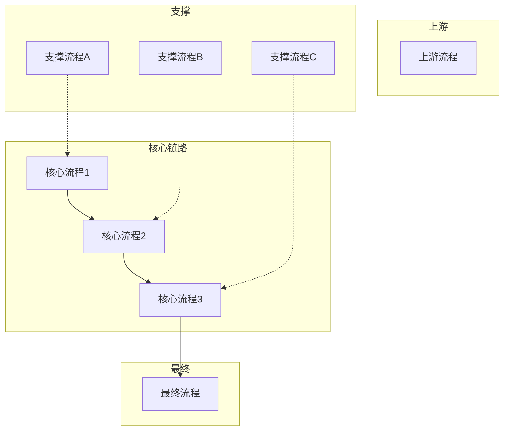
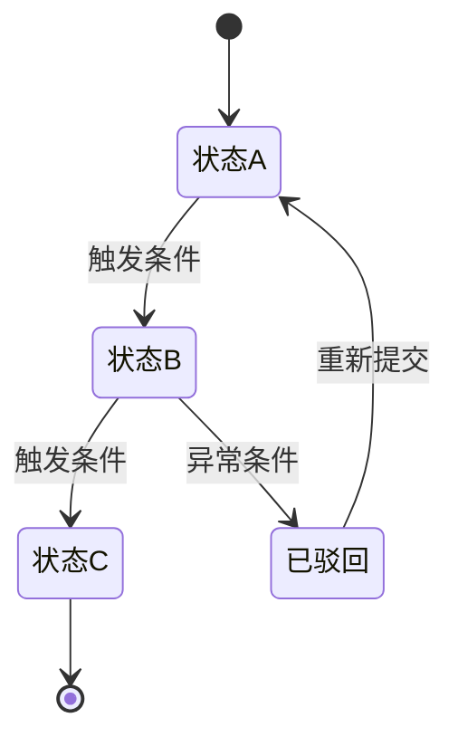
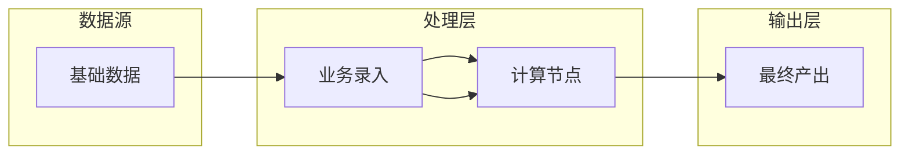

# Business Process Analysis from System PRD

When the user asks "梳理业务流程" or "有哪些业务流程" after a PRD is produced, deliver a structured business process analysis.

## When to Use

- User asks to analyze business processes from a system
- After completing a PRD, user wants process-level understanding
- Before starting prototype design — processes inform page flow

## Output Structure

### 1. Process Landscape Diagram (全景图)

使用 Mermaid 流程图展示所有流程及其关系：



### 2. Per-Process Deep Dive

For each identified process:

```
### 流程N：{流程名称} ⭐标记关键节点

**触发时机：** {when does this process start}
**涉及角色：** {who is involved}
**涉及页面：** {which system pages}

**步骤：**
Step1. {action} → {output}
Step2. {action} → {output}
...

**输出物：** {what deliverables}
**状态变更：** {state transitions}
**下游依赖：** {what follows}
```

### 3. State Machine

Document the complete lifecycle state transitions using Mermaid 状态机图：



同时提供状态码对照表（适用于已上线的系统）：
| 状态 | 状态码 | 描述 |
|:----|:-----:|:-----|
| 状态A | code_1 | 初始状态 |
| 状态B | code_2 | 已处理 |
| 状态C | code_3 | 已完结 |

### 4. Role-Permission Matrix

| 功能 | 角色A | 角色B | 角色C |
|:----|:----:|:----:|:----:|
| Fun1 | ✓ | ✓(本人) | - |

### 5. Key Data Dependency Chain

Show how data flows between processes using Mermaid：



### 6. Development Priority

Rank processes by development dependency:
| 优先级 | 流程 | 原因 |
|:-----:|:----|:-----|
| P0 | ... | 其他流程的数据基础 |

## Extraction Method

When building from a scraped system:

1. **Identify entry points** — which pages create new records? (订单、车辆录入)
2. **Trace status codes** — status-based pages (302→305→308→309→310) reveal the flow
3. **Follow data dependencies** — which pages reference data from which other pages?
4. **Map role interactions** — who creates vs who approves vs who views?
5. **Identify calculation nodes** — where does data transform? (称重→净重, 质检→缺件扣款, 结算=净重×单价-扣款)

## Common Patterns in Chinese Enterprise Systems

| Pattern | Example | How to Spot |
|:--------|:--------|:-----------|
| 申请→审核→完结 | 订单审核、结算审核 | Same table with audit_status field |
| 状态流转 | 302→305→称重→308→309→310 | Numeric status codes in URLs |
| 入库→出库 | 产物入库→产物出库 | In/Out paired modules |
| 基础数据→业务数据 | 客户→订单→车辆 | FK references in table columns |
| 价格配置→结算计算 | 车辆类型价格 + 生产系数 → 结算金额 | Price tables feeding settlement logic |
| 日报/月报汇总 | 拆解日报、成品仓日报 | Report pages with date range filters |
