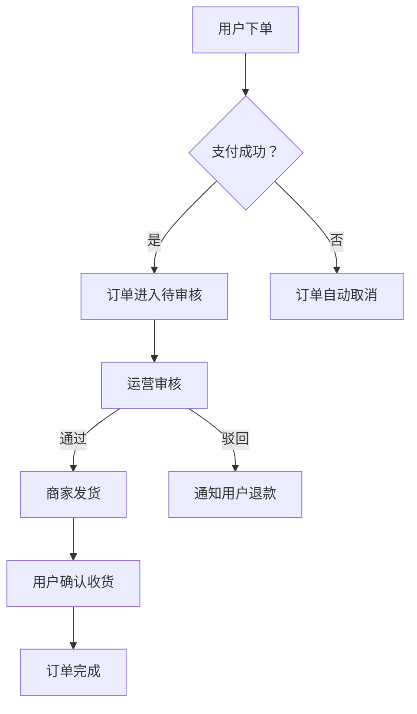

# PRD Template · 商用交付版 (VERSION A)

> 适用场景：项目投标、甲方交付、内部评审、开发排期、合同附件
> 设计规范：Ant Design 5.x（默认） | 修改见 Chapter 1
> 
> 📐 每章标注 [P0/P1/P2] 优先级
> 📊 每项需求标注 [M/S/C/W] 分级（Must/Should/Could/Won't）

---

## 文档控制

| 项目 | 内容 |
|------|------|
| 文档名称 | {项目名称} 产品需求文档 V{版本号} |
| 项目编号 | {PROJ-YYYY-NNN} |
| 起草人 | {姓名} |
| 评审人 | {姓名} |
| 批准人 | {姓名} |
| 创建日期 | {YYYY-MM-DD} |
| 最后更新 | {YYYY-MM-DD} |
| 文档状态 | 初稿 / 评审中 / 已定稿 |
| 保密级别 | 内部公开 / 部门保密 / 项目保密 |

### 附录：PRD质量自检表

> 提交PRD前逐项检查。全部 ✅ 方可交付。

```
□ [P0] Ch1 设计规范 — Token已定义（主色/背景/侧栏/字号/圆角）
□ [P0] Ch2 信息架构 — 树形导航 + 角色-菜单映射 + 默认落地页
□ [P1] Ch3 业务流程 — P0核心流程已标注【从XX页→弹窗XX→到XX页】
□ [P2] Ch4 系统架构 — 仅写了影响原型的部分（权限/数据流向/接口格式）
□ [P0] Ch5 页面清单 — 每个页面有唯一 data-page + 布局类型 + 依赖实体
□ [P0] Ch6 功能点 — 逐按钮/逐操作，每个有类型+触发+结果（无「多种」「各类」模糊词）
□ [P0] Ch7 数据模型 — 逐字段含类型/必填/选项值/展示控件/校验规则
□ [P0] Ch8 Mock数据 — 正常(≥5条) + 空态 + 极限三组
□ [P1] Ch9 边界条件 — 权限/校验/网络/精度/溢出处理方式已覆盖
□ [P0] Ch10 验收标准 — 每个模块 List/Detail/Action 三问已答
□ 所有枚举值已列全（没有被「多种」「各类」「等」模糊带过的）
□ 搜索条件已逐字段列出控件类型+options
□ 状态有对应的色值映射（仅AI原型版需要）
□ 关联实体跨页面数据一致（订单ID=车辆ID=质检ID）
```

## 版本历史

| 版本 | 日期 | 修订人 | 修订内容 |
|------|------|--------|---------|
| V1.0 | {date} | {name} | 初版创建 |
| V1.1 | {date} | {name} | 第2轮评审修订：修订XX模块字段表 |
| V2.0 | {date} | {name} | 定稿发布 |

---

## 第一章：项目概述 [P0]

### 1.1 项目背景

用1-2段话说明为什么要做这个项目，当前存在什么问题。

```
当前{业务场景}存在以下问题：
1. {痛点1}——导致{影响}
2. {痛点2}——导致{影响}
3. {痛点3}——导致{影响}

为解决上述问题，启动{项目名称}建设。
```

### 1.2 项目目标

| 目标维度 | 量化指标 | 当前值 | 目标值 | 衡量方式 |
|---------|---------|-------|-------|---------|
| 效率提升 | 订单处理耗时 | 15min/单 | ≤5min/单 | 系统埋点统计 |
| 准确率 | 数据录入错误率 | 8% | ≤1% | 月度抽检 |
| 用户体验 | NPS评分 | 42 | ≥65 | 季度调研 |
| 业务指标 | 在线交易占比 | 30% | ≥60% | 月度报表 |

### 1.3 项目范围

**在本期范围内：**
- ✅ {模块A}
- ✅ {模块B}
- ✅ {模块C}

**不在本期范围内（后续版本）：**
- ❌ {模块D} — 规划V2.0
- ❌ {模块E} — 规划V2.0
- ❌ {模块F} — 已取消

### 1.4 关键干系人

| 角色 | 职责 | 对接人 |
|------|------|--------|
| 项目发起人 | 重大决策、资源调配 | {姓名} |
| 产品负责人 | 需求确认、优先级 | {姓名} |
| 技术负责人 | 架构方案、工时评估 | {姓名} |
| 测试负责人 | 用例编写、验收 | {姓名} |
| 运营负责人 | 上线推广、反馈收集 | {姓名} |

---

## 第二章：用户与场景 [P0]

### 2.1 用户角色

| 角色名称 | 角色描述 | 核心诉求 | 使用频次 | 系统权限 |
|---------|---------|---------|---------|---------|
| 超级管理员 | 系统全局管理 | 配置/审计/日志 | 每日多次 | 全部 |
| 运营人员 | 日常业务运营 | 订单处理/审核/报表 | 每日 | 交易+报表 |
| 商家 | 商品管理 | 上架/库存/订单 | 每日 | 商品+订单 |
| 财务 | 结算管理 | 对账/发票/退款 | 每周 | 财务模块 |

### 2.2 用户故事

```
UC-01 [M] 订单审核
作为：运营人员
我想要：在订单列表页快速审核待处理订单
以便：提高订单流转效率，减少客户等待时间

验收标准：
- 订单列表支持按「待审核」状态筛选
- 单条审核：点击行弹出审核弹窗，选择通过/驳回+填写备注
- 批量审核：勾选多条后点击「批量审核」按钮
- 审核完成后列表自动刷新，状态实时更新
- 审核记录写入操作日志，可追溯

UC-02 [S] 数据导入
作为：运营人员
我想要：通过Excel批量导入商品信息
以便：快速完成商品上架，减少手工录入工作量

UC-03 [C] 消息通知
作为：商家
我想要：订单状态变更时收到系统通知
以便：及时处理待办事项
```

### 2.3 核心业务流程图



> *注：如甲方有Visio/ProcessOn流程图，直接嵌入图片替代上述Mermaid*

---

## 第三章：功能需求 [P0]

### 3.1 功能全景图（Feature Map）

```
┌─ {系统名称}
├── 模块一：交易管理
│   ├── 订单列表       [M] P0
│   ├── 订单详情       [M] P0
│   ├── 审核管理       [M] P0
│   ├── 退款管理       [S] P1
│   └── 评价管理       [C] P2
├── 模块二：商品管理
│   ├── 商品列表       [M] P0
│   ├── 商品上架       [M] P0
│   ├── 分类管理       [S] P1
│   └── 品牌管理       [W] P2
├── 模块三：报表中心
│   ├── 销售报表       [S] P1
│   └── 用户报表       [C] P2
└── 模块四：系统设置
    ├── 用户管理       [M] P0
    └── 角色权限       [M] P0
```

[M]=Must必须有 / [S]=Should应该有 / [C]=Could可以有 / [W]=Won't本次不做

### 3.2 模块详细规格

> 每个模块按以下结构展开

#### 模块：{模块名称}

**功能ID：** {MOD}-M{NN}
**优先级：** P0 / P1 / P2
**MoSCoW：** M / S / C
**前置依赖：** {依赖模块}

**功能描述：**
{1-3句功能概述}

**功能清单：**

| 编号 | 功能点 | 操作类型 | 触发方式 | 预期结果 | 依赖数据 |
|------|--------|---------|---------|---------|---------|
| {ID}-01 | 查询订单 | Search | 点击搜索按钮 | 表格刷新 | Order API |
| {ID}-02 | 查看详情 | Navigation | 点击表格行 | 跳转详情页 | Order ID |
| {ID}-03 | 审核订单 | Modal | 点击审核按钮 | 弹出审核弹窗 | Review Data |
| {ID}-04 | 导出Excel | Download | 点击导出按钮 | 触发文件下载 | Export API |
| {ID}-05 | 批量审核 | Modal+Batch | 勾选+批量审核按钮 | 弹出审核弹窗 | selectedIds |

**业务规则：**
- Rule 1：只有「待审核」状态的订单才能审核
- Rule 2：审核通过后订单自动通知商家发货
- Rule 3：审核驳回需填写驳回原因，原因长度≥5字
- Rule 4：批量审核上限100条/次

**异常处理：**
| 异常场景 | 系统行为 | 用户感知 |
|---------|---------|---------|
| 网络超时 | 3次自动重试 | Toast「网络异常，请稍后重试」 |
| 订单已被他人审核 | 提交时校验 | Toast「该订单正在被XXX审核」 |
| 选择数量超100条 | 前端拦截 | Toast「批量操作上限100条」 |

---

## 第四章：非功能需求 [P1]

### 4.1 性能要求

| 指标 | 要求 | 衡量方式 |
|------|------|---------|
| 页面加载 | ≤2秒（首屏） | Lighthouse |
| 列表查询 | ≤500ms（10万条数据） | API响应时间 |
| 搜索响应 | ≤1秒 | API P95 |
| 并发用户 | 500同时在线 | 压测报告 |
| 数据导出 | ≤30秒（10万条） | 实际测试 |

> **B端系统SLA参考标准：**
> ```
> 页面加载 ≤2s / 列表查询 ≤500ms / 搜索响应 ≤1s
> 并发 500+ / 可用率 ≥99.5% / 备份: 每日全量+2h增量
> P0故障响应 ≤30min / 灾备恢复 ≤4h
> ```

> **参考：常见B端系统SLA标准 — 根据项目实际调整**
> - 页面加载: 2s首屏 / 5s完全加载（Ant Design Dashboard基准）
> - 列表查询: 500ms P95（含后端+网络传输）
> - 搜索响应: 1s P95（模糊搜索较慢，精准搜索应≤200ms）
> - 并发: 500同时在线（一般B端）/ 2000+（SaaS高并发场景需额外说明）
> - 可用率: ≥99.5%（每月≤3.6h停机）/ ≥99.9%（金融级≤43min停机）
> - 备份: 每日全量+每2h增量 / 灾备恢复RTO≤4h

### 4.2 安全要求

- [ ] 用户密码加密存储（bcrypt/argon2）
- [ ] 接口鉴权（JWT + Refresh Token）
- [ ] 敏感数据脱敏（手机号/身份证）
- [ ] 操作日志记录（谁、什么时间、做了什么）
- [ ] 防XSS/CSRF/SQL注入

### 4.3 可用性要求

- [ ] 系统可用率 ≥ 99.5%
- [ ] 计划内维护窗口：每周四凌晨2:00-4:00
- [ ] 数据备份：每日全量 + 每2小时增量
- [ ] 灾备恢复：目标≤4小时

---

## 第五章：数据模型 [P0]

### 5.1 实体关系图（ERD）

> *注：如使用draw.io/ProcessOn绘制ER图，直接嵌入图片*

```
Order —— 1:N —— OrderItem
Order —— N:1 —— Customer
Order —— 1:1 —— Review
Order —— N:1 —— Merchant
```

### 5.2 核心数据字典

#### 实体：订单（Order）

| 字段名 | 类型 | 长度 | 必填 | 默认值 | 选项值/范围 | 说明 |
|--------|------|------|------|--------|------------|------|
| id | bigint | 20 | Y | 自增 | — | 主键 |
| order_no | varchar | 32 | Y | — | — | 订单号，格式：ORD+日期+序列 |
| customer_id | bigint | 20 | Y | — | — | 买家ID，关联Customer表 |
| merchant_id | bigint | 20 | Y | — | — | 卖家ID，关联Merchant表 |
| status | tinyint | 4 | Y | 0 | 0=待支付,1=待审核,2=待发货,3=已发货,4=已完成,5=已取消,6=退款中 | 订单状态 |
| total_amount | decimal | 10,2 | Y | 0.00 | ≥0 | 订单总金额 |
| payment_method | tinyint | 4 | Y | 0 | 0=微信,1=支付宝,2=银行转账 | 支付方式 |
| paid_at | datetime | — | N | NULL | — | 支付时间 |
| remark | varchar | 500 | N | — | — | 买家备注 |
| created_at | datetime | — | Y | NOW() | — | 创建时间 |
| updated_at | datetime | — | Y | NOW() | — | 更新时间 |

#### 实体：审核记录（Review）

| 字段名 | 类型 | 长度 | 必填 | 选项值 | 说明 |
|--------|------|------|------|--------|------|
| id | bigint | 20 | Y | — | 主键 |
| order_id | bigint | 20 | Y | — | 关联订单ID |
| reviewer_id | bigint | 20 | Y | — | 审核人ID |
| action | tinyint | 4 | Y | 1=通过,2=驳回 | 审核结果 |
| reason | varchar | 500 | N | — | 驳回原因（驳回时必填） |
| created_at | datetime | Y | — | 审核时间 |

### 5.3 状态机

```
订单状态机：
0:待支付 ──[支付成功]──→ 1:待审核
0:待支付 ──[超时取消]──→ 5:已取消
1:待审核 ──[审核通过]──→ 2:待发货
1:待审核 ──[审核驳回]──→ 6:退款中
2:待发货 ──[商家发货]──→ 3:已发货
3:已发货 ──[确认收货]──→ 4:已完成
4:已完成 ──[申请退款]──→ 6:退款中
6:退款中 ──[退款完成]──→ 4:已完成
```

---

## 第六章：界面与交互 [P0]

> 详细的页面规格参见《Chapter 5: 页面清单》和《Chapter 6: 功能点清单》

### 6.1 设计规范

**默认设计系统：Ant Design 5.x** | 也可按项目选择↓

| Token | Ant Design 5.x | Element Plus | TDesign | Arco Design |
|-------|---------------|-------------|---------|-------------|
| 品牌主色 | #1677FF | #409EFF | #0052D9 | #165DFF |
| 背景色 | #F5F7FA | #F5F7FA | #FFFFFF | #F2F3F5 |
| 侧栏色 | #001529 | #304156 | #1E293B | #232324 |
| 正文 | 14px | 14px | 14px | 14px |
| 圆角 | 6px | 4px | 6px | 8px |

> **选择参考：** React技术栈→Ant Design / Vue3→Element Plus / 全端统一→TDesign / 现代B端→Arco Design

### 6.2 页面清单

| data-page | 页面标题 | 所属模块 | 布局类型 | 依赖数据 |
|-----------|---------|---------|---------|---------|
| dashboard | 数据概览 | 首页 | 看板 | 订单统计 |
| order-list | 订单列表 | 交易管理 | 表格+筛选 | Order |
| order-detail | 订单详情 | 交易管理 | 详情展示 | Order/OrderItem |
| order-review | 审核弹窗 | 交易管理 | Modal表单 | Review |
| product-list | 商品列表 | 商品管理 | 表格+筛选 | Product |
| product-form | 商品上架 | 商品管理 | 表单页 | Product/Category |
| user-list | 用户管理 | 系统设置 | 表格+筛选 | User |
| role-list | 角色管理 | 系统设置 | 表格+筛选 | Role |

---

## 第七章：接口规范 [P1]

### 7.1 接口设计规范

```
统一返回格式：
{
  "code": 0,          // 0=成功, 非0=失败
  "msg": "success",   // 提示信息
  "data": {}          // 业务数据
}

分页参数：
?page=1&pageSize=20

状态码：
- 0: 成功
- 400: 参数错误
- 401: 未登录
- 403: 无权限
- 500: 服务端错误
```

### 7.2 核心接口清单

| 接口 | 方法 | URL | 说明 | 优先级 |
|------|------|-----|------|--------|
| 订单列表 | GET | /api/order/list | 分页查询订单 | P0 |
| 订单详情 | GET | /api/order/{id} | 获取单条订单 | P0 |
| 审核订单 | POST | /api/order/review | 审核通过/驳回 | P0 |
| 批量审核 | POST | /api/order/batch-review | 批量审核 | P0 |
| 导出订单 | GET | /api/order/export | 导出Excel | P1 |
| 商品列表 | GET | /api/product/list | 分页查询商品 | P0 |

---

## 第八章：风险与路线图 [P1]

### 8.1 风险评估

| 风险 | 概率 | 影响 | 应对策略 |
|------|------|------|---------|
| 第三方依赖接口SLA不满足 | 中 | 高 | 增加本地缓存降级方案 |
| 数据迁移量大导致上线延迟 | 中 | 中 | 提前启动数据清洗，分批次迁移 |
| 甲方需求变更频繁 | 高 | 高 | 明确变更流程，每轮需求冻结期 |

### 8.2 分期交付路线图

```
Phase 1（首期 · Week 1-8）— MVP核心功能
├── 交易管理：订单列表/详情/审核 [M][P0]
├── 商品管理：商品列表/上架 [M][P0]
├── 系统设置：用户/角色管理 [M][P0]
└── 数据看板：基础统计 [M][P0]

Phase 2（增强 · Week 9-14）— 业务增强
├── 退款管理 [S][P1]
├── 报表中心 [S][P1]
├── 商品分类管理 [S][P1]
└── 评价管理 [C][P2]

Phase 3（优化 · Week 15-20）— 体验优化
├── 消息通知 [C][P2]
├── 高级报表 [C][P2]
└── 品牌管理 [W]
```

### 8.3 交付物清单

| 交付物 | 说明 | 交付时间 |
|--------|------|---------|
| PRD文档 V1.0（本章） | 产品需求规格 | Week 1 |
| 高保真交互原型 | 可点击HTML原型 | Week 2 |
| 设计稿（Figma） | 像素级设计 | Week 3 |
| 开发环境 | 可运行MVP | Week 8 |
| UAT测试报告 | 验收通过 | Week 8 |
| 用户手册 | 操作指南 | Week 9 |

---

## 第九章：附录

### 9.1 术语表

| 术语 | 解释 |
|------|------|
| OE号 | 原厂配件编号，唯一标识 |
| VIN码 | 车辆识别码，17位 |
| 拆车件 | 从报废车辆拆解的配件 |

### 9.2 参考文档

| 文档名称 | 版本 | 来源 |
|---------|------|------|
| {相关文档1} | Vx.x | {部门/甲方} |
| {相关文档2} | Vx.x | {部门/甲方} |

### 9.3 竞品对标分析

| 竞品 | 可借鉴功能 | 差异化方向 |
|------|-----------|-----------|
| 竞品A | 一键导入功能 | 更准确的OCR识别 |
| 竞品B | 审核流程 | 更灵活的批量操作 |
| 竞品C | 报表可视化 | 更丰富的筛选维度 |

---

> **本文档为一式两份的正式交付物。甲方确认签字后，即作为项目验收依据。**
